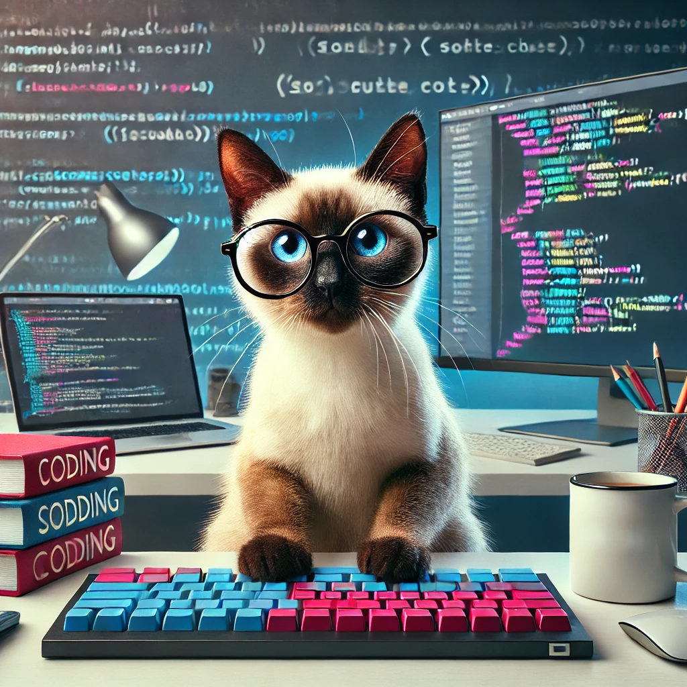

# Daria Klaus			

**Address:**           Hamburger Berg 320359 Hamburg\
**Mobile phone:**      +4917556458542\
**e-mail:**			  daklaus16@gmail.com\
**LinkedIn:**		  [linkedin](https://www.linkedin.com/)\
**Discord:**           marmushka_10104



## About me
I'm Daria Klaus, Software Engineer with 8 years experience. 
I specialize in the development and maintenance of a Java application based on the Spring framework.
## Professional development
06.2021 - present 	    **Software Engineer, Robert Bosch GmbH**
- Development and maintenance of a Java application based on Spring
- Performance optimization through profiling and memory management
- Implementation of code reviews
-  Development of interactive user interfaces with Angular and TypeScript
- Technologies/Tools/Frameworks: Java, TypeScript, Intellij, Git, Gradle, Spring, Hibernate, MySQL, Angular, Scrum, VisualVM, Jira

02.2019 - 03.2020 	    **Java Backend Developer, SportScheck GmbH**
* Development and maintenance of a Java application based on Spring
* Creation of database structures with SQL
* Technologies/Tools/Frameworks: Java, Eclipse, Subversion, Maven, Spring, Hibernate, PostgreSQL, Scrum, Jira

08.2016 - 07.2018	    **Software Engineer, Mercedes-Benz Group**
* Planning, development and maintenance of a Java application in the automotive sect
* Planning, development and maintenance of 10 internal software applications in C#
* Development of RESTful APIs services
* Technologies/Tools/Frameworks: Java, C#, Eclipse, Visual Studio, Git, Maven, RESTFul, TestNG, Swagger, Postman

## Education 

10.2010 - 02.2014	**Stuttgart University**\
                     Master of Science, Computer Science


## Knowledge & skills
**Language:** 		           
* German: Fluent
* English: Intermediate
* Russian: Native

**Programming languages:** 	    
* Java: Very good user knowledge
* TypeScript: Very good user knowledge
* SQL: Very good user knowledge

**Technologies/Tools/Frameworks:**  

Intellij, Git, Gradle, Spring, Hibernate, MySQL, Angular, Scrum, VisualVM, Jira

**Certificates:**

10/2016 - ISTQB Certified Tester\
02/2017 - iSQI Certified Agile Tester

## Completed projects

* [CV](https://github.com/marmushka/rsschool-cv)

## Code examples
```
function multiply(a, b){
  return a * b
}

``` 
